# Open Dot Spell Architecture Document

**Status:** System Design for Step 03. This document defines system architecture, trust boundaries, domain entities, state machines, durable execution, failure handling, and API/provider contracts. No application code is implemented at this step.

**Product:** Open Dot Spell  
**Scope:** Single-owner, local-first personal AI assistant powered by local and open models.

---

## 1. Architectural Philosophy and Overview

Open Dot Spell is designed as a **laptop-sized, local-first, single-node application**. It is engineered to turn open-ended human responsibilities into durable, inspectable, bounded work without requiring cloud dependencies, distributed brokers, or complex cluster management.

### Key Principles

1. **Local-First & Minimal Infrastructure:** The application runs on the user's workstation. Persistence uses embedded SQLite with Write-Ahead Logging (WAL); no external database daemon (PostgreSQL, MySQL), message broker (Kafka, RabbitMQ), or cache (Redis) is required.
2. **Strict Separation of Concerns:**
   - The **Web UI** presents information and gathers user intent.
   - The **API / Application Server** authenticates the user session, performs authorization, validates inputs, and coordinates storage.
   - The **Durable Worker** claims tasks, manages leases, interfaces with inference runtimes, invokes tools, verifies completion evidence, and commits artifacts.
3. **The Model Proposes, the Application Authorizes:** The generative model is treated as an untrusted reasoning engine. It proposes tool invocations, but cannot authorize them. The server-side policy engine evaluates every action against scope and policy, requesting human approval when risk thresholds are exceeded.
4. **Evidence-Based Completion:** The model saying "done" or emitting a summary does not complete a task. Tasks only complete when deterministic evidence (file hashes, exit codes, verified diffs) matches declared completion criteria.
5. **At-Least-Once Durable Execution:** Work is structured to survive process crashes, power interruptions, and lease expirations. Stale workers are fenced, checkpoints are persisted, and state updates commit atomically with event logs.

---

## 2. System Architecture and Component Responsibilities

The system consists of the following core components running on the host:

```text
+-----------------------------------------------------------------------------------------+
|                                     HOST WORKSTATION                                    |
|                                                                                         |
|  +-----------------------+                    +--------------------------------------+  |
|  |     Browser Client    | <--- HTTP/SSE ---> |              API Server              |  |
|  | (Single-Owner Web UI) |                    |  (Session Auth, REST API, Event Hub) |  |
|  +-----------------------+                    +------------------+-------------------+  |
|                                                                  |                      |
|                                                                  v                      |
|  +---------------------------------------------------------------+-------------------+  |
|  |                                      Core / Domain Layer                          |  |
|  |     (Policy Engine, Approval System, State Machines, Artifact Manager, Audit Log) |  |
|  +-----------------------+---------------------------------------+-------------------+  |
|                          |                                       |                      |
|                          v                                       v                      |
|  +--------------------------------+                    +-----------------------------+  |
|  |         Database Layer         |                    |        Durable Worker       |  |
|  | (SQLite WAL, Atomic Tx, Leases)|                    | (Task Poller, State Engine) |  |
|  +--------------------------------+                    +--------------+--------------+  |
|                                                                       |                 |
|            +--------------------------+-------------------------------+                 |
|            |                          |                               |                 |
|            v                          v                               v                 |
|  +-------------------+      +-------------------+          +----------------------+     |
|  |   Model/Provider  |      |  Tool Dispatcher  |          |   Artifact Storage   |     |
|  |  Adapter (Ollama) |      | (Validation/Exec) |          | (Staged / Atomic FS) |     |
|  +-------------------+      +---------+---------+          +----------------------+     |
|                                       |                                                 |
|                   +-------------------+--------------------+                            |
|                   |                                        |                            |
|                   v                                        v                            |
|  +----------------------------------+   +------------------------------------+          |
|  |    Isolated Coding Sandbox       |   |    Controlled Browser Container    |          |
|  | (Container/cgroup: Diff/Test/FS) |   | (Ephemeral Session, Bounded URLs)  |          |
|  +----------------------------------+   +------------------------------------+          |
+-----------------------------------------------------------------------------------------+
```

### Component Breakdown

1. **Web Application:** Single-user client interface rendered in the browser. Interacts with the backend via REST endpoints and streams execution updates via Server-Sent Events (SSE). Never holds root secrets or direct execution handles.
2. **API / Server:** Lightweight local HTTP service bound strictly to loopback (`127.0.0.1`). Validates requests, authenticates the owner session, validates `Host` and `Origin` headers, enforces CSRF mitigation, coordinates state transitions, and serves artifacts.
3. **Durable Worker:** Background execution loop running as a separate local process or thread pool. Polls the database for ready tasks using transactional lease acquisition (`FOR UPDATE` simulation via SQLite transactions). Executes tool calls, evaluates evidence, and handles checkpointing.
4. **Core / Domain Layer:** Encapsulates the domain model, state machines, validation rules, policy evaluations, and approval logic. Zero network dependencies; purely deterministic logic.
5. **Database Layer:** Embedded SQLite with WAL mode enabled. Handles relational entities, leasing metadata, event ledgers, and fencing tokens. Avoids holding long transactions during external I/O or model calls.
6. **Model / Provider Layer:** Capability-aware abstraction layer. Adapts provider-specific protocols (initially Ollama REST API) into a unified internal streaming event model. Tracks capabilities (e.g., tool calling, context window, vision, structured output) per model.
7. **Tool Dispatcher:** Server-side engine that maps validated tool requests to registered handlers. Enforces parameter schemas, execution timeouts, output size ceilings, and sandbox forwarding.
8. **Policy Layer:** Evaluates whether a proposed tool call is allowed, requires human approval, or is denied based on the active privacy mode, target path, and risk category.
9. **Approval System:** Manages the lifecycle of consequential action requests. Binds human approval cryptographically to the immutable fingerprint of the proposed action and ensures one-time consumption.
10. **Artifact System:** Manages durable outputs (summaries, diffs, reports) in local filesystem storage using atomic two-phase write staging (`.staging/<hash>` -> rename to destination) and version tracking in SQLite.
11. **Isolated Coding Environment:** Containerized or OS-sandboxed environment used exclusively for repository inspection, modification, and test execution. No access to the Docker daemon socket or host secrets.
12. **Controlled Browser Environment:** Bounded headless browser instance running with restricted navigation policies, ephemeral session storage, and strict network isolation.

---

## 3. Trust Boundaries and Threat Model

A personal assistant running on a local workstation interacts with untrusted external content. The application defines explicit boundaries to ensure untrusted data cannot hijack execution authority.

```text
[Untrusted World] (Websites, repos, external docs, model tokens)
        |
        v
[Inference / External Runtime] (Ollama, Browser, Sandbox)
        | (Raw strings, proposed tool calls)
        v
[Policy & Validation Boundary] (Schema checks, Path guards, Permission rules)
        | (Validated & Authorized Action)
        v
[Core Execution Engine] (Durable Worker, Approvals, SQLite, Atomic FS)
        ^
        | (Approved commands, User tokens)
[Authenticated Owner] (Local browser on 127.0.0.1 with session cookie/header)
```

### Trust Classification

| Entity / Source | Trust Level | Justification / Security Rule |
| :--- | :--- | :--- |
| **Local User / Owner** | **Trusted** | The single owner of the machine. Confirmed via loopback session token. |
| **API Server / Core Engine** | **Trusted** | Enforces policy, owns database transactions, and guards the filesystem. |
| **Durable Worker** | **Trusted (Bounded)** | Holds execution leases; bounded by fencing tokens and database constraints. |
| **Model Output** | **Untrusted** | LLM text and proposed tool calls can be influenced by prompt injections. Must be validated against schemas and evaluated by the policy engine. |
| **Webpage Content** | **Untrusted** | Web pages retrieved during research may contain malicious instructions ("ignore previous instructions"). Treated purely as opaque text. |
| **Retrieved Documents** | **Untrusted** | Workspace files or user documents may contain hostile prompts or malformed payloads. |
| **Tool Descriptions** | **Untrusted Input** | Third-party or MCP tool definitions cannot self-authorize or elevate permissions. |
| **MCP Integrations** | **Untrusted** | External tool protocols cannot alter core system policy. |
| **Sandbox Execution** | **Semi-Trusted / Isolated** | Code execution runs in an isolated sandbox. It cannot communicate with the host except through stdout/stderr pipes and explicitly mounted directories. |

### Core Security Axioms

1. **Localhost is Not Authentication:** Any process on the user machine or malicious JavaScript on a web page could attempt to hit `127.0.0.1:port`. The API must require an owner session token, validate `Host` headers (`127.0.0.1` or `localhost`), and enforce CORS/SameSite/CSRF restrictions.
2. **The Model Cannot Self-Authorize:** A model proposal is never an execution grant.
3. **No Dynamic Permission Expansion:** Neither tool outputs nor prompt text can grant additional access rights to the assistant.

---

## 4. Minimum Domain Entities

The core domain model represents single-owner workflows. Speculative multi-tenant or distributed entities are excluded.

### 1. Workspace
- **Purpose:** Represents an approved directory root on the host filesystem that the assistant may inspect or operate upon.
- **Fields:** `id` (UUID), `name` (string), `root_path` (string, canonical path), `allowed_globs` (JSON array of strings), `denied_globs` (JSON array of strings), `created_at` (timestamp).
- **Relationships:** Has many `Artifacts`, `Documents`, and `Tasks`.
- **Lifecycle:** Created by user; immutable root path; deleted by user.

### 2. AssistantProfile
- **Purpose:** Declares system instructions, default model selection, and tool configuration for a specific role (e.g., General Assistant, Code Refactorer).
- **Fields:** `id` (UUID), `slug` (string, unique), `name` (string), `system_prompt` (string), `default_provider_id` (UUID), `default_model` (string), `enabled_tool_ids` (JSON array of strings), `created_at` (timestamp).
- **Relationships:** Referenced by `Conversation` and `Responsibility`.

### 3. Conversation
- **Purpose:** Represents an interactive chat session between the user and assistant.
- **Fields:** `id` (UUID), `profile_id` (UUID), `title` (string), `model_id` (string), `provider_id` (string), `created_at` (timestamp), `updated_at` (timestamp).
- **Relationships:** Has many `Messages`; belongs to `AssistantProfile`.
- **Lifecycle:** Active until archived or deleted by user.

### 4. Message
- **Purpose:** Single dialogue turn within a conversation.
- **Fields:** `id` (UUID), `conversation_id` (UUID), `role` (`user` | `assistant` | `system`), `content` (string), `token_count` (int, nullable), `created_at` (timestamp).
- **Relationships:** Belongs to `Conversation`; may reference `ToolCall` or `Artifact`.

### 5. Responsibility
- **Purpose:** Represents an ongoing, durable user objective (e.g., "Keep release notes updated", "Daily triage of test failures").
- **Fields:** `id` (UUID), `workspace_id` (UUID), `title` (string), `description` (string), `status` (`active` | `paused` | `archived`), `created_at` (timestamp).
- **Relationships:** Has many `Goals` and `Schedules`.

### 6. Goal
- **Purpose:** Concrete milestone derived from a responsibility or user prompt with explicit success criteria.
- **Fields:** `id` (UUID), `responsibility_id` (UUID, nullable), `workspace_id` (UUID), `title` (string), `description` (string), `success_criteria` (JSON array of strings), `status` (enum, see State Machines), `created_at` (timestamp), `updated_at` (timestamp).
- **Relationships:** Belongs to `Responsibility`; has many `Plans` and `Tasks`.

### 7. Plan
- **Purpose:** Ordered, inspectable sequence of proposed steps to achieve a goal.
- **Fields:** `id` (UUID), `goal_id` (UUID), `version` (int), `steps` (JSON array of structured steps), `status` (`draft` | `accepted` | `superseded`), `created_at` (timestamp).
- **Relationships:** Belongs to `Goal`; generates `Tasks`.

### 8. Task
- **Purpose:** Bounded unit of executable work with defined inputs, constraints, and target outputs.
- **Fields:** `id` (UUID), `goal_id` (UUID), `plan_step_id` (string, nullable), `title` (string), `status` (enum, see State Machines), `retry_count` (int), `max_retries` (int), `created_at` (timestamp), `updated_at` (timestamp).
- **Relationships:** Belongs to `Goal`; has many `Runs`.

### 9. Run
- **Purpose:** A single execution attempt of a Task.
- **Fields:** `id` (UUID), `task_id` (UUID), `worker_id` (string, nullable), `lease_expires_at` (timestamp, nullable), `fencing_token` (int), `status` (enum, see State Machines), `started_at` (timestamp), `finished_at` (timestamp, nullable), `error_message` (string, nullable).
- **Relationships:** Belongs to `Task`; has many `RunEvents`, `ToolCalls`, and `Approvals`.

### 10. RunEvent
- **Purpose:** Append-only event ledger entry tracking granular run execution for inspectability and timeline replay.
- **Fields:** `id` (int, auto-increment), `run_id` (UUID), `sequence_number` (int), `event_type` (string, e.g., `run_started`, `model_invoked`, `tool_proposed`, `approval_requested`, `tool_completed`, `run_failed`), `payload` (JSON), `created_at` (timestamp).
- **Relationships:** Belongs to `Run`.

### 11. ToolCall
- **Purpose:** Specific invocation of a bounded tool within a Run.
- **Fields:** `id` (UUID), `run_id` (UUID), `tool_name` (string), `input_arguments` (JSON), `output_result` (JSON, nullable), `status` (enum, see State Machines), `action_fingerprint` (string, SHA-256), `requires_approval` (boolean), `created_at` (timestamp), `completed_at` (timestamp, nullable).
- **Relationships:** Belongs to `Run`; has one `Approval` (if required).

### 12. Approval
- **Purpose:** Record of human authorization or rejection for a consequential ToolCall.
- **Fields:** `id` (UUID), `run_id` (UUID), `tool_call_id` (UUID), `action_fingerprint` (string, SHA-256), `action_summary` (string), `decision` (`pending` | `approved` | `denied` | `expired` | `invalidated`), `decided_at` (timestamp, nullable), `consumed_at` (timestamp, nullable), `expires_at` (timestamp).
- **Relationships:** Belongs to `Run` and `ToolCall`.

### 13. Artifact & ArtifactVersion
- **Purpose:** Inspectable output produced by a Run (e.g., file patch, markdown summary, audit report).
- **Fields (Artifact):** `id` (UUID), `workspace_id` (UUID), `name` (string), `current_version` (int), `created_at` (timestamp).
- **Fields (ArtifactVersion):** `id` (UUID), `artifact_id` (UUID), `version` (int), `run_id` (UUID), `relative_path` (string), `content_hash` (string, SHA-256), `content_type` (string), `byte_size` (int), `provenance` (JSON metadata linking source tasks and evidence), `created_at` (timestamp).
- **Relationships:** Belongs to `Workspace`; produced by `Run`.

### 14. Memory & Document
- **Purpose:** Approved retained context and indexed reference material.
- **Fields (Memory):** `id` (UUID), `scope` (`global` | `workspace`), `workspace_id` (UUID, nullable), `key` (string), `content` (string), `source_type` (string), `created_at` (timestamp), `updated_at` (timestamp).
- **Fields (Document):** `id` (UUID), `workspace_id` (UUID), `path` (string), `content_hash` (string), `indexed_at` (timestamp).

### 15. Schedule / Trigger
- **Purpose:** Timed or event-based trigger initiating a Responsibility run.
- **Fields:** `id` (UUID), `responsibility_id` (UUID), `cron_expression` (string), `is_enabled` (boolean), `last_run_at` (timestamp, nullable), `next_run_at` (timestamp).

### 16. ProviderConfiguration
- **Purpose:** Local inference runtime or remote provider adapter configuration.
- **Fields:** `id` (UUID), `provider_type` (`ollama` | `custom_remote`), `base_url` (string), `is_local` (boolean), `is_enabled` (boolean), `capabilities` (JSON array of strings), `created_at` (timestamp).

---

## 5. State Machines and Lifecycles

All state transitions must be explicit and enforced at the domain/database layer. Stale or invalid transitions must return errors.

### 1. Goal State Machine

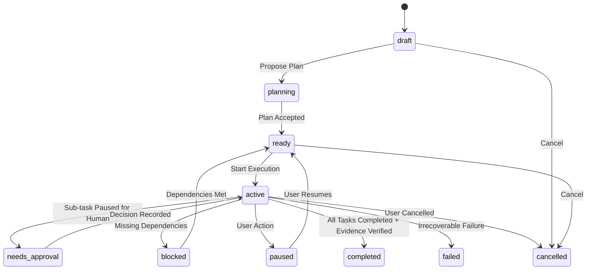

- **Legal Terminal States:** `completed`, `failed`, `cancelled`.
- **Completion Guard:** A Goal cannot transition to `completed` unless every associated Task is `completed` and all defined success criteria have verified evidence.

---

### 2. Task State Machine

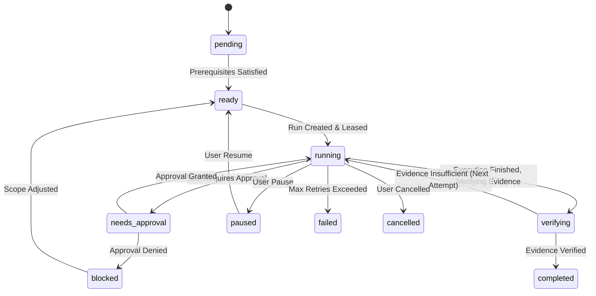

- **Legal Terminal States:** `completed`, `failed`, `cancelled`.
- **Retry Semantics:** If a Task fails or is interrupted before reaching `completed`, retrying creates a **new `Run`** entity with an incremented `retry_count`. The Task status returns to `ready`. The previous `Run` remains recorded in history.

---

### 3. Run State Machine

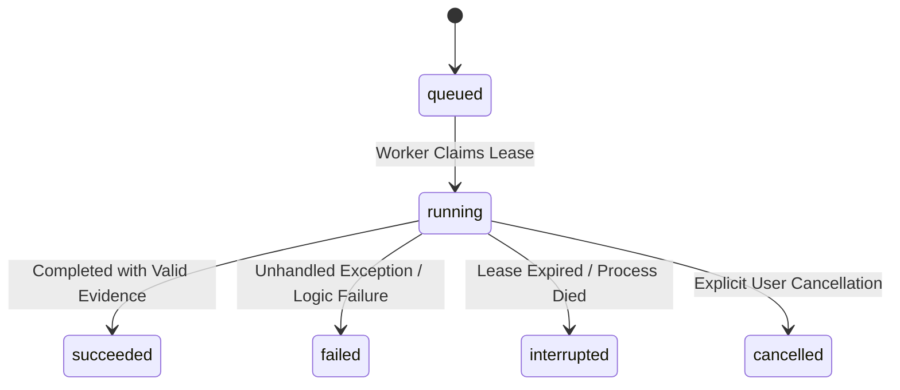

- **Legal Terminal States:** `succeeded`, `failed`, `interrupted`, `cancelled`.
- **Fencing Rule:** Only a worker holding a valid, non-expired lease and the current `fencing_token` can transition a Run from `running` to `succeeded` or `failed`.

---

### 4. ToolCall State Machine

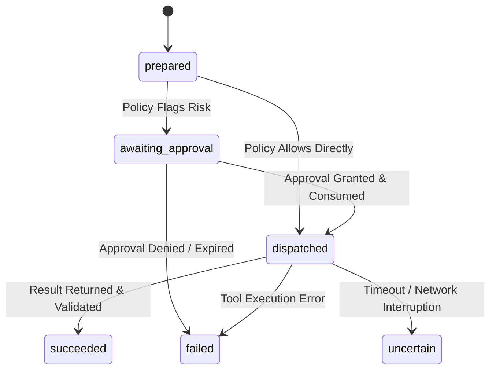

- **Legal Terminal States:** `succeeded`, `failed`, `uncertain`.
- **The `uncertain` State:** Used when an external action (e.g., HTTP POST, git push) was dispatched but the worker lost connection or timed out before receiving a response. **The system must never blindly retry an `uncertain` tool call.** It requires human review.

---

### 5. Approval State Machine

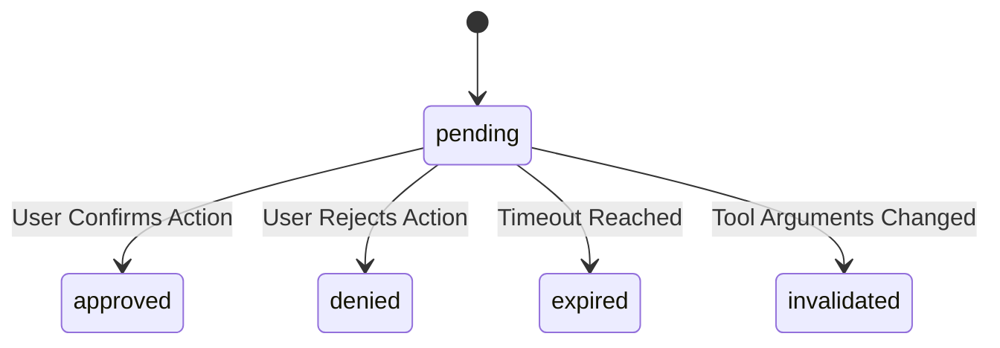

- **Legal Terminal States:** `approved`, `denied`, `expired`, `invalidated`.
- **Single-Use Authority:** Once an approval is in state `approved`, transitioning the associated `ToolCall` to `dispatched` atomically sets `consumed_at = CURRENT_TIMESTAMP`. An approval cannot be consumed twice.

---

## 6. Completion Semantics and Evidence Verification

### Axiom: Model Output is Not Evidence

A model output containing words such as "I have completed the task", "Done", or "The tests passed" has zero evidential weight.

### Evidence Verification Rules

1. **Deterministic Verification:** Every Task definition includes a set of required `EvidenceCriteria`. Before transitioning a Task to `completed`:
   - For file modifications: The system must verify the file exists on disk, matches the expected path within the approved workspace, and matches the recorded `content_hash` (SHA-256).
   - For code execution/tests: The system must parse the structured exit code (`exit_code == 0`) and verify standard test runner outputs from the isolated environment.
   - For artifacts: The artifact must be committed through the atomic staging pipeline and recorded in the database.
2. **Subjective or Open-Ended Criteria:** When success criteria cannot be deterministically verified by a local tool (e.g., "Draft a pleasant email summary"), the task transition requires explicit **User Review and Confirmation**.

---

## 7. Durable Execution and Recovery

### Execution Guarantee: At-Least-Once Task Execution

Open Dot Spell guarantees **at-least-once task execution**. In the event of worker crashes, OS reboot, or power failure, tasks in progress will be detected and resumed from safe checkpoints.

> [!WARNING] Exactly-Once Execution is Impossible for External Side Effects
> If an external tool action (such as writing to a network endpoint or non-transactional filesystem) is interrupted after dispatch but before the result is persisted, the side effect may have occurred. The system marks such state as `uncertain` and prompts the user rather than re-executing automatically.

### Concurrency and Leasing Model

1. **Transactional Lease Claims:** Workers acquire tasks by executing an atomic update against SQLite:
   ```sql
   UPDATE runs
   SET worker_id = :worker_id,
       lease_expires_at = datetime('now', '+30 seconds'),
       fencing_token = fencing_token + 1,
       status = 'running'
   WHERE id = (
       SELECT id FROM runs
       WHERE status = 'queued'
       LIMIT 1
   );
   ```
2. **Heartbeats:** The active worker extends its lease every 10 seconds:
   ```sql
   UPDATE runs
   SET lease_expires_at = datetime('now', '+30 seconds')
   WHERE id = :run_id AND worker_id = :worker_id AND fencing_token = :fencing_token;
   ```
3. **Fencing Tokens:** Every lease update increments a monotonic `fencing_token`. If a worker encounters a network or thread stall and attempts to write state after its lease has been acquired by a new worker, the write fails because the token no longer matches.
4. **No DB Transactions Across External I/O:** Database transactions are committed immediately when updating metadata or recording events. Database connections are never held open while waiting for model inference, container execution, or external network requests.
5. **Atomic Commit with Event Ledger:** When a tool call succeeds or state changes, the state change and the corresponding `RunEvent` are committed in the same atomic SQLite transaction.

---

## 8. Failure Handling and Recovery Matrix

| Failure Mode | Detection Mechanism | System Response & Recovery Action |
| :--- | :--- | :--- |
| **Worker Death / Crash** | Lease expiration (`lease_expires_at < CURRENT_TIMESTAMP`). | A watchdog or newly started worker discovers the expired lease. Marks the current `Run` as `interrupted`. Spawns a new `Run` attempt if `retry_count < max_retries`, or transitions Task to `failed` requiring user review. |
| **API Server Restart** | Startup recovery sweep. | On boot, the server scans the database for dangling `running` states. Verifies worker health, invalidates in-flight unconsumed approvals, and notifies connected Web UIs. |
| **Interrupted Model Stream** | Network socket close / chunk timeout. | The partial response is preserved as a cancelled/interrupted stream event. The incomplete text is never treated as a final tool call or completion. The worker records `model_stream_interrupted` in `RunEvent` and retries inference. |
| **Expired Lease (Zombie Worker)** | Fencing token mismatch on write. | The zombie worker's write is rejected with `StaleLeaseError`. The zombie worker immediately terminates its local execution loop and releases local resources. |
| **Changed Approval Parameters** | Hash check on approval consumption. | If the tool arguments change between the approval request and the user decision, the calculated SHA-256 fingerprint differs. The approval is marked `invalidated` and a fresh approval is requested. |
| **Task Cancellation** | User issues `POST /api/runs/:id/cancel`. | Run status is updated to `cancelled`. An interruption signal is sent to the worker/container process. Future tool calls for this run are rejected by the dispatcher. |
| **Disk Full / Write Failure** | Filesystem exception on write/staging. | Staging write fails before commit. The transaction rolls back. The Task transitions to `paused` with a `DiskFullError` event. Existing database records remain consistent. |
| **SQLite Lock Contention** | `SQLITE_BUSY` error. | SQLite WAL mode is configured with a 5000ms busy timeout. Workers use exponential backoff with jitter (50ms - 500ms) for write conflicts. |
| **Uncertain External Side Effect** | Timeout after tool dispatch. | ToolCall transitions to `uncertain`. The Run pauses execution and emits an `action_uncertainty_detected` event. Requires human confirmation before proceeding. |

---

## 9. Approval Model and Cryptographic Action Fingerprinting

To prevent authorization bypass or parameter tampering, approvals are bound to an immutable cryptographic fingerprint of the intended action.

### Action Fingerprint Construction

```text
Fingerprint = SHA256( tool_name + "\n" + canonical_json(arguments) + "\n" + target_resource )
```

- `canonical_json` ensures deterministic sorting of dictionary keys with no unnecessary whitespace.
- `target_resource` specifies the exact canonical file path, host domain, or resource ID.

### Approval Enforcement Lifecycle

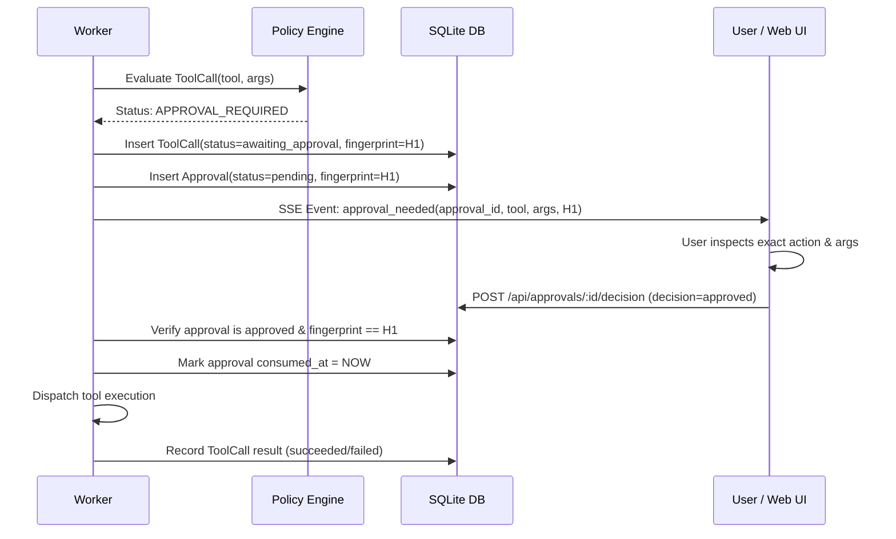

**Security Invariants:**
1. An approval can only be consumed if `ToolCall.action_fingerprint == Approval.action_fingerprint`.
2. An approval cannot be consumed if `consumed_at IS NOT NULL`.
3. If the user edits tool parameters, the old approval is marked `invalidated` and a new fingerprint is calculated.

---

## 10. Tool Policy Engine and Permissions Matrix

The policy engine evaluates every tool invocation proposal on the server. The model's system prompt or requested tool call cannot alter these rules.

### Default Policy Matrix

| Policy Category | Operation Examples | Default Permission | Configurable Scope |
| :--- | :--- | :--- | :--- |
| **Read Workspace Files** | Read file, list directory within approved workspace | **Allowed** | Bounded to approved `workspace.root_path` and `allowed_globs`. |
| **Write New Files** | Create new file in workspace | **Approval Required** | May be set to allowed for sandboxed output directories. |
| **Overwrite / Delete Files** | Modify or delete existing files | **Approval Required** | Always requires approval by default to prevent data loss. |
| **Isolated Code Execution** | Run tests or scripts in container sandbox | **Approval Required** | May be set to auto-allowed if sandbox network is disabled. |
| **Host Shell Execution** | Run commands on host OS | **DENIED** | **Never permitted**; all code execution must be sandboxed. |
| **Browser Navigation** | Open URL, inspect DOM | **Approval Required** | Domain whitelist can allow specific documentation domains. |
| **Browser Form / Login** | Fill forms, click buttons, submit input | **Approval Required** | Always requires human approval. |
| **External Communication** | Outbound HTTP requests, webhooks | **Approval Required** | Denied in `Local-only` and `Offline` privacy modes. |
| **Git / Version Control** | `git diff`, `git status` | **Allowed** | Read-only inspect operations. |
| **Git Mutations** | `git commit`, `git checkout` | **Approval Required** | Modifies repository state. |
| **GitHub Mutations** | Push branch, create pull request | **Approval Required** | External mutation. |
| **Access to Secrets** | Read `.env`, API keys, certificates | **DENIED** | Blocked by default path filters (`.env*`, `*.pem`, `*.key`). |
| **Remote Model Inference** | Send prompt tokens to remote LLM | **Approval Required** | Denied unless `Hybrid` privacy mode is explicitly enabled. |

---

## 11. Local Application API Contracts

All endpoints run on `http://127.0.0.1:<PORT>` and require the `X-OpenDotSpell-Session` header.

### 1. Health & Readiness
- **GET `/api/health`**
  - **Purpose:** Health check, service status, and active privacy mode.
  - **Response (200 OK):**
    ```json
    {
      "status": "healthy",
      "version": "0.1.0-alpha",
      "privacy_mode": "local_only",
      "database": "connected",
      "worker": "active"
    }
    ```

### 1b. Single-Owner Authentication & Session Lifecycle (Step 06)
- **GET `/api/auth/status`**
  - **Purpose:** Retrieve local pairing and authentication status.
  - **Response (200 OK):** `{"paired": true, "authenticated": true}`
- **POST `/api/auth/pair`**
  - **Purpose:** Pair local client using one-time terminal pairing code.
  - **Request:** `{"pairingSecret": "hex_secret_here"}`
  - **Response (200 OK):** `{"token": "session_token_here", "expiresIn": 86400}` (and sets `opendotspell_session` HttpOnly cookie)
- **POST `/api/auth/logout`**
  - **Purpose:** Invalidate session token and clear browser cookie.
  - **Response (200 OK):** `{"success": true}`

### 1c. Provider Credentials Management (Step 06)
- **GET `/api/credentials`**
  - **Purpose:** List configured provider credentials (metadata and masked previews only).
  - **Response (200 OK):**
    ```json
    [
      {
        "id": "cred_123",
        "providerId": "anthropic",
        "name": "Work Key",
        "maskedValue": "sk-...wxyz",
        "createdAt": "...",
        "updatedAt": "..."
      }
    ]
    ```
- **POST `/api/credentials`**
  - **Purpose:** Encrypt at rest and store a provider credential. Raw secret is never logged or returned.
  - **Request:** `{"providerId": "anthropic", "name": "Work Key", "secret": "sk-ant-..."}`
  - **Response (201 Created):** `{"id": "cred_123", "providerId": "anthropic", "name": "Work Key", "maskedValue": "sk-...wxyz"}`

### 2. Provider Management
- **GET `/api/providers`**
  - **Purpose:** List configured model runtimes and discovered capabilities.
  - **Response (200 OK):**
    ```json
    {
      "providers": [
        {
          "id": "prov_ollama_local",
          "type": "ollama",
          "base_url": "http://127.0.0.1:11434",
          "is_local": true,
          "is_enabled": true,
          "models": [
            {
              "name": "gemma2:9b",
              "capabilities": ["streaming", "tool_calling", "structured_output"],
              "context_window": 8192
            }
          ]
        }
      ]
    }
    ```
- **POST `/api/providers/test`**
  - **Purpose:** Test connectivity and probe capabilities of a local/remote runtime.
  - **Request:** `{"provider_type": "ollama", "base_url": "http://127.0.0.1:11434"}`
  - **Response (200 OK):** `{"status": "reachable", "latency_ms": 12, "detected_models": ["gemma2:9b"]}`

### 3. Conversations & Messages
- **GET `/api/conversations`** / **POST `/api/conversations`**
  - **Purpose:** List or create conversation sessions.
  - **Request (POST):** `{"profile_id": "prof_default", "title": "Repo Refactoring"}`
  - **Response (201 Created):** `{"id": "conv_123", "title": "Repo Refactoring", "created_at": "..."}`
- **POST `/api/conversations/:id/messages`**
  - **Purpose:** Post user message and initiate streaming response.
  - **Request:** `{"content": "Summarize the changes in src/index.ts"}`
  - **Response (202 Accepted):** `{"message_id": "msg_456", "stream_url": "/api/conversations/conv_123/stream"}`

### 4. Goals, Tasks, and Runs
- **POST `/api/goals`**
  - **Purpose:** Create a durable goal with defined success criteria.
  - **Request:**
    ```json
    {
      "workspace_id": "ws_123",
      "title": "Update Documentation",
      "description": "Generate summary artifact for recent code changes",
      "success_criteria": ["artifact_created:docs/SUMMARY.md", "exit_code:0"]
    }
    ```
  - **Response (201 Created):** `{"goal_id": "goal_789", "status": "planning"}`
- **GET `/api/runs/:id/events`**
  - **Purpose:** SSE or polling endpoint for granular run timeline events.
  - **Response (200 OK / SSE stream):** Stream of `RunEvent` objects.
- **POST `/api/runs/:id/pause`**
  - **Purpose:** Pause an active execution run.
  - **Response (200 OK):** `{"run_id": "run_101", "status": "paused"}`
- **POST `/api/runs/:id/cancel`**
  - **Purpose:** Cancel a run and invalidate all associated pending authority.
  - **Response (200 OK):** `{"run_id": "run_101", "status": "cancelled"}`
- **POST `/api/tasks/:id/resume`**
  - **Purpose:** Resume a paused or blocked task from its latest checkpoint.
  - **Response (200 OK):** `{"task_id": "task_202", "run_id": "run_102", "status": "ready"}`

### 5. Approvals
- **POST `/api/approvals/:id/decision`**
  - **Purpose:** Record human decision on a pending approval.
  - **Request:** `{"decision": "approved"}` or `{"decision": "denied", "reason": "Target path incorrect"}`
  - **Response (200 OK):** `{"approval_id": "appr_303", "status": "approved", "consumed": false}`

### 6. Artifacts
- **GET `/api/artifacts/:id/versions/:version`**
  - **Purpose:** Retrieve verified artifact content and provenance metadata.
  - **Response (200 OK):**
    ```json
    {
      "artifact_id": "art_404",
      "version": 1,
      "content_hash": "sha256_abcdef...",
      "content_type": "text/markdown",
      "content": "# Summary...",
      "provenance": {
        "run_id": "run_101",
        "sources": ["src/index.ts"]
      }
    }
    ```

### 7. Memory & Schedules
- **GET/POST/DELETE `/api/memory`**
  - **Purpose:** Inspect, add, or delete approved retained memories.
- **GET/POST `/api/schedules`**
  - **Purpose:** Manage periodic scheduled responsibilities.

---

## 12. Provider Streaming Event Contract and Capability Discovery

### Provider-Neutral Streaming Event Model

The model provider adapter converts raw model chunks into normalized internal events:

```typescript
type ProviderEvent =
  | { type: "text_delta"; delta: string }
  | { type: "tool_call_start"; tool_call_id: string; tool_name: string }
  | { type: "tool_call_chunk"; tool_call_id: string; arguments_delta: string }
  | { type: "tool_call_complete"; tool_call_id: string; tool_name: string; arguments: Record<string, unknown> }
  | { type: "usage"; prompt_tokens: number; completion_tokens: number }
  | { type: "completed"; finish_reason: "stop" | "tool_calls" | "length" | "error" }
  | { type: "error"; code: string; message: string; fatal: boolean };
```

### Incomplete Tool Call Stream Handling

If streaming terminates abruptly while receiving a `tool_call_chunk`:
1. The partial JSON buffer is flagged as corrupted.
2. The partial tool call is discarded and never dispatched to the policy engine.
3. The event ledger records a `tool_stream_aborted` event.
4. The worker retries the inference turn or marks the run as interrupted.

### Capability Discovery Contract

The provider layer interrogates local runtimes (e.g., via `ollama show <model>` or capability probing):
- `supports_tools`: boolean
- `supports_json_schema`: boolean
- `supports_vision`: boolean
- `context_limit`: integer
- `supports_streaming`: boolean

Models lacking tool-calling capability will not have tool definitions injected into their prompts; they operate purely in conversational mode.

---

## 13. Artifact Model and Atomic Staging

To prevent corrupt, partial, or unverified files from appearing in the user's workspace, artifacts are committed through a two-phase atomic staging pipeline.

```text
[Worker Execution]
       | Writes content
       v
[Staging Directory] -> ~/.opendotspell/staging/<hash>.tmp
       | Calculates SHA-256, verifies criteria
       v
[Atomic Rename]     -> ~/.opendotspell/artifacts/<artifact_id>/v<version>.bin
       | Atomically updates DB
       v
[Database Record]   -> Insert ArtifactVersion with content_hash and provenance
       | (Optional Workspace Mirror)
       v
[Workspace Copy]    -> Safely writes to user workspace if approved
```

### Invariants:
1. An artifact version is immutable once committed.
2. File paths within artifacts use relative POSIX paths; absolute host paths are prohibited.
3. If writing fails or disk space runs out during staging, the temporary file is unlinked and no database record is committed.

---

## 14. Host Execution Boundary and Sandbox Isolation

Model-generated arbitrary shell commands on the host operating system are strictly forbidden.

### Sandbox Security Architecture

```text
+---------------------------------------------------------------------------------+
|                                 APPLICATION HOST                                |
|                                                                                 |
|  +-----------------------------+                                                |
|  |     Open Dot Spell Core     |                                                |
|  |   (API, Worker, Database)   |                                                |
|  +--------------+--------------+                                                |
|                 | Standard I/O Pipe / gRPC                                      |
|                 v                                                               |
|  +---------------------------------------------------------------------------+  |
|  |                           CONTAINER SANDBOX                               |  |
|  |  - Ephemeral filesystem layer                                             |  |
|  |  - Read-only mount of target repository (writes to copy-on-write overlay) |  |
|  |  - Dedicated non-root user (uid: 1000)                                    |  |
|  |  - No Docker socket access (/var/run/docker.sock NOT MOUNTED)             |  |
|  |  - Network disabled by default (--network none)                           |  |
|  |  - Dropped Linux capabilities (ALL capabilities dropped)                  |  |
|  |  - Resource limits: max 2 CPU cores, max 2 GB RAM, 60s CPU timeout        |  |
|  +---------------------------------------------------------------------------+  |
+---------------------------------------------------------------------------------+
```

### Known Limitations of Container Isolation

Containerization (Docker, Apple Virtualization Framework) provides defense-in-depth, not absolute theoretical containment:
- Kernel vulnerabilities can theoretically allow container breakouts.
- Shared CPU resources can be susceptible to side-channel or denial-of-service timing attacks.
- Sandboxes are therefore paired with strict input validation, read-only overlays, and explicit user approvals before code is committed back to the host repository.

---

## 15. Resource Budgets and Default Design Constraints

The following resource ceilings are **design defaults**, not measured benchmarks. They are configured to protect host stability during local execution.

| Resource / Parameter | Default Design Limit | Purpose / Justification |
| :--- | :--- | :--- |
| **Max Task Duration** | 300 seconds (5 min) | Prevents infinite worker loops on stalled jobs. |
| **Max Retries per Task** | 3 attempts | Prevents endless error cycling on unrecoverable faults. |
| **Max Tool Calls per Run** | 25 invocations | Prevents runaway agent loops and model hallucination cycles. |
| **Max Artifact Size** | 10 MB per file | Protects host disk storage and database metadata. |
| **Max File Read Size** | 2 MB per file | Avoids overflowing model context windows and memory buffers. |
| **Max Model Context Size** | 8,192 tokens | Conservative default for local consumer hardware (16 GB RAM). |
| **Max Concurrent Inference Jobs** | 1 job | Prevents local GPU/Metal out-of-memory contention on M-series chips. |
| **Max Browser Actions per Task** | 15 actions | Limits resource consumption and prevents runaway navigation. |
| **Worker Lease Duration** | 30 seconds | Balances crash detection speed with clock jitter tolerance. |
| **Worker Heartbeat Interval** | 10 seconds | Ensures lease renewal well before expiration. |

---

## 16. Architecture Diagrams

### 1. System Architecture

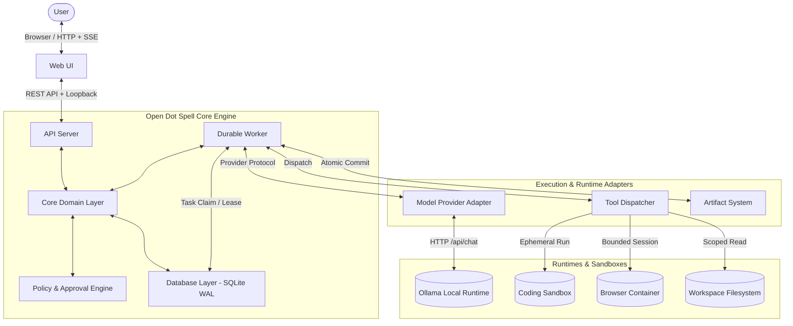

---

### 2. Trust Boundaries

```mermaid
flowchart LR
    subgraph Untrusted [Untrusted Content]
        U1[Web Page HTML]
        U2[Model Output Tokens]
        U3[Workspace Source Code]
        U4[Third-Party MCP Descriptions]
    end

    subgraph Boundary [Validation & Policy Boundary]
        V1[Input Schema Validator]
        V2[Path Traversal Guard]
        V3[Policy Engine & Approval Guard]
    end

    subgraph Trusted [Trusted Host Application]
        T1[API Server - Loopback Session]
        T2[SQLite Storage & Leases]
        T3[Durable Worker]
        T4[Host Filesystem Artifacts]
    end

    Untrusted --> Boundary
    Boundary --> Trusted
```

---

### 3. Task Execution Lifecycle

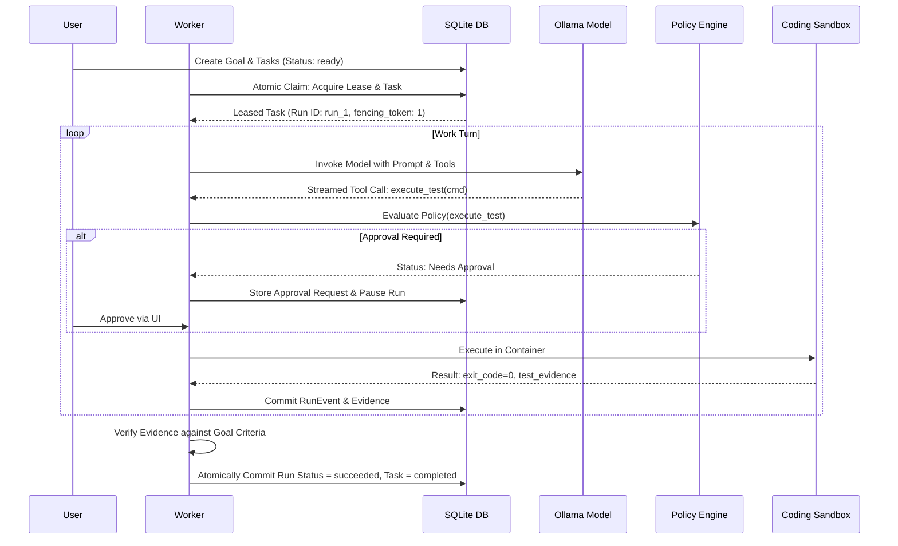

---

### 4. Approval Flow

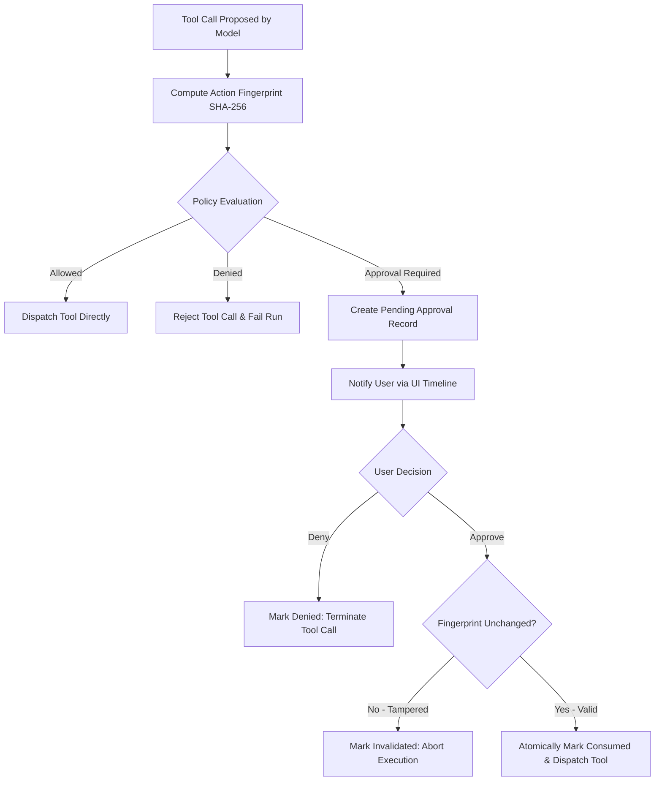

---

### 5. Failure and Recovery Flow

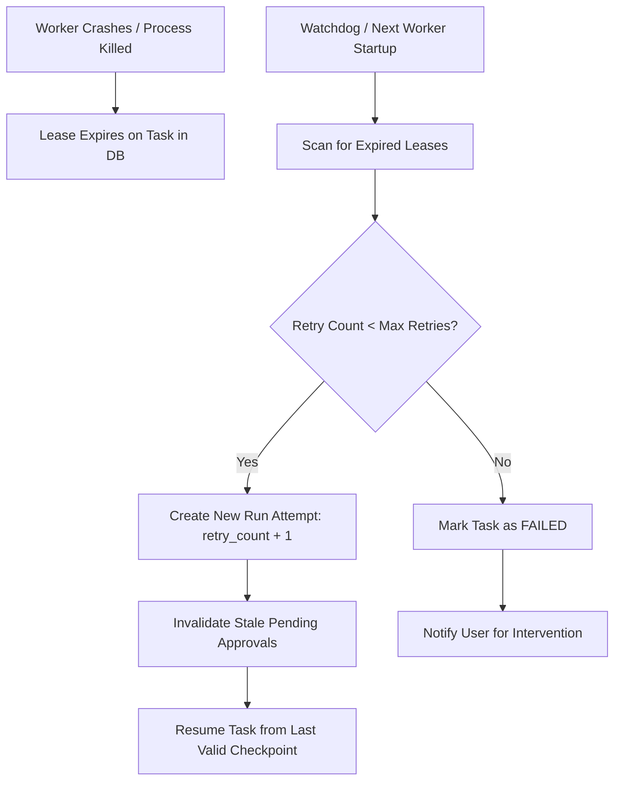

---

## 17. Current Implementation Boundary

Step 03 defines system contracts, boundaries, state machines, and failure handling. It does not implement application source code. All contracts specified herein serve as the authoritative reference for subsequent implementation steps.
